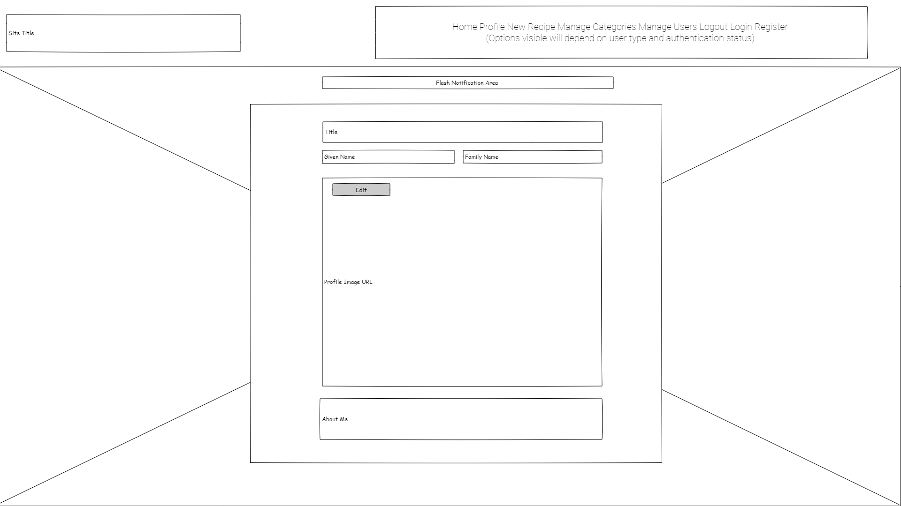
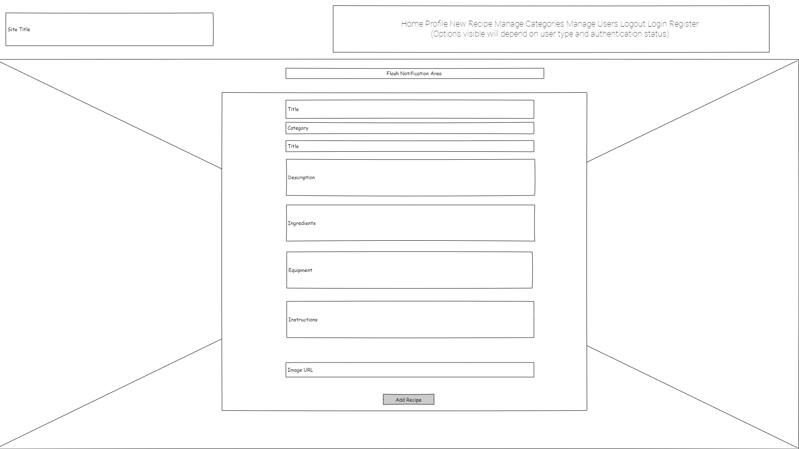
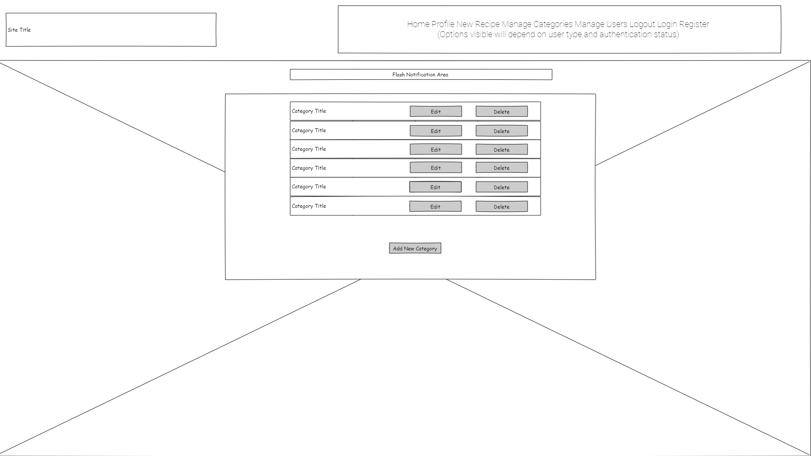

# The Meating Place Website

## 1. Project Websites

View the live project here:  
- [The Meating Place](https://the-meating-place.herokuapp.com/)  

This is the main website for people to contribute, read and exchange recipes. It is designed to be responsive and accessible on a range of devices, making it easy to navigate for amateur and professional chefs alike.

Visit the Project Website and Shared Resource Area Here:  
- [The Meating Place Project](https://github.com/etiennedevaux/TheMeatingPlace)

This is the GitHub project area for people to collaborate, contribute and to download or share code for other projects.

## 2. User Experience (UX)
### User stories

#### First Time Visitor Goals
As a First Time Visitor I want to:
- quickly see a range of the recipes that have been contributed.
- be able to browse the recipes that have already been uploaded.
- be able to view recipe ingredients, equipment and instructions for a selected recipe.
- be able to see a brief profile of the person who uploaded the recipe.

#### Returning Visitor Goals
As a Returning Visitor I want to be able to achieve all of the First Time Visitor goals and also want to:
- be able to register as a user and create my own profile.
- be able to create and save my own recipes.

#### Registered User Goals
As a Registered User I want to achieve all of the First Time Visitor and Returning Visitor goals and also want to:
- be able to edit my user profile.
- be able to update and delete my own recipes.
 
#### Web-Based Administrator
As a Web-Based Administrator I want to be able to achieve all of the First Time Visitor, Returning Visitor and Registered User goals and also want to:   
- Create, Read, Update and Delete the recipe Categories
- Create, Read, Update and Delete Registered Users

### Design  
#### Colour Scheme  
The two main colours used are purple and white, but the artwork includes many shades in order to portray an authentic French-style restaurant.

#### Typography
The Montserrat font is the main font used throughout the whole website with Sans Serif as the fallback font in case for any reason the font isn't being imported into the site correctly. Montserrat is a clean font, so it is both attractive and will work well for different screen sizes.  Variety is provided with use of colours, letter spacing, shadows and varying font weights.

#### Imagery  
The background imagery is important, and is visible throughout the site.  Low levels of transparency are used to help the main features blend naturally with the background image. The images is designed to portray an image of informal dining, with high-quality, well prepared food.

## 3. Wireframes

Wireframes are created using the Evolus Pencil wireframe and prototyping tool [Evolus Pencil](https://pencil.evolus.vn/)

### Home Page / Recipe Page Wireframe
Desktop  

Tablet  
  
Mobile    
  

### Login Page Wireframes  
Desktop  

Tablet  
  
Mobile    

### Edit Recipe Page Wireframe  
Desktop  
  
Tablet  
  
Mobile    

### Register Page Wireframe
Desktop  
  
Tablet  
  
Mobile    

### Profile Page Wireframe  
Desktop  
  
Tablet  
  
Mobile    

### Edit Personal Profile Page Wireframe
Desktop
  
Tablet  
  
Mobile    

### New Recipe Page Wireframe
Desktop  
  
Tablet  
  
Mobile    

### Manage Categories Page Wireframe
Desktop  
  
Tablet  
  
Mobile    

### Edit Categories Page Wireframe
Desktop  
  
Tablet  
  
Mobile    

### Manage Users Page Wireframe
Desktop  
  
Tablet  
  
Mobile    

### Edit User Page Wireframe
Desktop  
  
Tablet  
  
Mobile    

## 4. Features
Responsive design, ensuring a high-quality user experience on all device sizes.

Consistent design of user controls across the site.

Defaults to a well designed 404 page, providing user feedback if a URL does not exist and on errors where a find query returns no results.

The search filter is a drop down, select box, which is only populated with categories that have been associated with a menu
Testing
The W3C Markup Validator and W3C CSS Validator Services were used to validate every page of the project to ensure there were no syntax errors in the project.

### 4.1 Navigation Bar and Background Image  

The Navigation Bar appears throughout the user journey on the site, ensuring that users always have rapid navigation across and around the site.

The Navigation Bar itself is responsive, so that it changes with screen sizes to adapt to different devices.  The options appearing on the navigation bar vary in accordance with whether the user is new, registered and logged in or logged in as an administrator.

The colour scheme reflects the background image, which also appears throughout the site.

### 4.2 Home Page / Recipes Page

The home page and recipes page are the same.  The purpose of the site is immediately clear, and does not warrant distracting information.  This page is visible to all users, the features within it change in accordance with whether or not the user is logged in and whether or not they are the owner of the recipes.

The Recipes are listed in reverse order of when they were added or last modified.

#### 4.2.1 Recipe Information

The recipe information appears firstly in a long list with a summary.  That summary contains an image, a title, a description and information about the creator.

An arrow on the image indicates that the user should click for more information, in fact they can click on any part of the recipe row.  When they do this information about the Ingredients, Equipment and Cooking Instructions appear.

If the person logged in was the creator of the recipe then an Edit button will appear, clicking on this will take the user to the Edit Recipe page.

With a second click, that additional information disappears.

#### 4.2.2 Recipe Creator Information

The name of the creator and their image appear by default.  When the mouse is over the image then user profile information replaces the recipe description.  When the mouse is moved away this reverts.

For small devices, such as mobile devices, the creator image disappears to prioritise the recipe information.

#### 4.2.3 Recipe Filters

The recipes can be filtered by the Course Category (e.g. Main, Dessert, Starter etc).

The data query is designed to only show the categories that have been used plus the 'All', so that a zero return will not happen.  Categories can, therefore, be available to users creating new recipes, but until they are used they will not appear in the dropdown.

The backend Python handles the All option so that the recipes are not filtered.

The dropdown defaults to 'All', and returns to 'All' when a filter is applied - this gives a single click to clear the filter.

### 4.3 Register Page

The Register Page serves the simple purpose of allowing new users to register an account.

All fields are completed by the user typing, they then click the Register button that posts the content to the Flask App, which creates the relevant document in the MongoDB database.

Once the registration is posted the user is given a confirmation in the Flash Message area and then logged in with their new credentials and directed to their personal profile page, which they can edit at any time.

If the username already exists the user is given a message to that effect in the Flash Message area and then directed to a blank registration page.

### 4.4 Login Page

The login page allows the user to enter their username and a hashed password.

Once logged in a Welcome message is shown in the Flash Messages area and the user is directed first to their Profile Page.

### 4.5 Profile Page

The profile page shows a user their own profile.  When profile is selected from the Navigation Bar the backend Python detects the username and renders the profile template, populated with the correct data.  

A user attempting to interpolate the URL may be successful, but will not be shown the edit button, so security will not be breached.  An unsuccessful attempt to interpolate, or accidental entry of a URL, will direct to the 404 page.

### 4.6 Edit Profile Page

The Edit Profile page takes the username from the environment,and will therefore only edit the profile for the logged in user.

The editable fields of the user profile are displayed (username and password are not editable)

### 4.7 New Recipe Page

The New Recipe menu option appears only to logged in users.

Recipe Categories are drawn the full Categories list, managed by the Admin account.  An entry is mandated.

The rest of the fields are text entry with the Recipe Name and Recipe Description being mandated.

### 4.8 Edit Recipe Page

The edit recipe page allows the recipe owner to change any of the fields and submit an update.

The owner can also delete a recipe

Changes are confirmed via the Flash Messages window

### 4.9 Manage Categories Page

The manage categories page is only available to the admin user.

Categories can be created, read, updated or deleted from here.

All existing categories can be viewed on a single screen.

### 4.10 Add New Category Page

The new category is typed in, once posted the addition is confirmed in the Flash Messages window and the user returned to the Manage Categories Page

### 4.11 Edit Category Page

The page is prepopulated with the selected category.
Changes are typed in, once posted the change is confirmed in the Flash Messages window and the user returned to the Manage Categories Page

### 4.1.2 Manage Users Page

The Manage Users page is only available to the admin user.

All users are listed with username, given name and family name.

Users can be edited or deleted.

### Edit User Page

The Edit User page is only available to the admin user.

username, given and first names, about me section and the profile image can be updated.

Once submitted the action is confirmed and the user returned to the Manage Users Page.

### Log Out

When the log out option is selected the action is confirmed via the Flash Messages section

The user is returned to the Login Page

## 5. Technologies Used

Languages Used

HTML5
CSS3
Javascript
Python

Flask

Jinja

Bootstrap JS 5.1.0:
Bootstrap CSS 4.1.3 (to avoid presentation issues due to change in use of relative position)
Bootstrap was used to assist with the responsiveness and styling of the website.
Font Awesome:
Font Awesome was used on all pages throughout the website to add icons for aesthetic and UX purposes.
Materialize 1.0.0

jQuery 3.5.1:

Git
Git was used for version control by utilizing the Gitpod terminal to commit to Git and Push to GitHub.
GitHub:
GitHub is used to store the projects code after being pushed from Git.
Microsoft Photo Editor
Photo Editor resizing images and editing photos for the website.
Pencil:
Balsamiq was used to create the wireframes during the design process.
Interactive elements

Visual Studio Code

Mongo DB

Heroku

W3C Markup Validator - Results
W3C CSS Validator - Results

## 6. Testing User Stories from User Experience (UX) Section
The 404 page gives clear feedback to the user, and after a short delay, will redirect to the home page.  The Home Page can be selected sooner.
First Time Visitor Goals
As a First Time Visitor, I want to easily understand the main purpose of the site and learn more about the organisation.

Upon entering the site, users are automatically greeted with a clean and easily readable navigation bar to go to the page of their choice. Underneath there is a Hero Image with Text and a "Learn More" Call to action button.
The main points are made immediately with the hero image
The user has two options, click the call to action buttons or scroll down, both of which will lead to the same place, to learn more about the organisation.
As a First Time Visitor, I want to be able to easily be able to navigate throughout the site to find content.

The site has been designed to be fluid and never to entrap the user. At the top of each page there is a clean navigation bar, each link describes what the page they will end up at clearly.
At the bottom of the first 3 pages there is a redirection call to action to ensure the user always has somewhere to go and doesn't feel trapped as they get to the bottom of the page.
On the Contact Us Page, after a form response is submitted, the page refreshes and the user is brought to the top of the page where the navigation bar is.
As a First Time Visitor, I want to look for testimonials to understand what their users think of them and see if they are trusted. I also want to locate their social media links to see their following on social media to determine how trusted and known they are.

Once the new visitor has read the About Us and What We Do text, they will notice the Why We are Loved So Much section.
The user can also scroll to the bottom of any page on the site to locate social media links in the footer.
At the bottom of the Contact Us page, the user is told underneath the form, that alternatively they can contact the organisation on social media which highlights the links to them.
Returning Visitor Goals
As a Returning Visitor, I want to find the new programming challenges or hackathons.

These are clearly shown in the banner message.
They will be directed to a page with another hero image and call to action.
As a Returning Visitor, I want to find the best way to get in contact with the organisation with any questions I may have.

The navigation bar clearly highlights the "Contact Us" Page.
Here they can fill out the form on the page or are told that alternatively they can message the organisation on social media.
The footer contains links to the organisations Facebook, Twitter and Instagram page as well as the organization's email.
Whichever link they click, it will be open up in a new tab to ensure the user can easily get back to the website.
The email button is set up to automatically open up your email app and autofill there email address in the "To" section.
As a Returning Visitor, I want to find the Facebook Group link so that I can join and interact with others in the community.

The Facebook Page can be found at the footer of every page and will open a new tab for the user and more information can be found on the Facebook page.
Alternatively, the user can scroll to the bottom of the Home page to find the Facebook Group redirect card and can easily join by clicking the "Join Now!" button which like any external link, will open in a new tab to ensure they can get back to the website easily.
If the user is on the "Our Favourites" page they will also be greeted with a call to action button to invite the user to the Facebook group. The user is incentivized as they are told there is a weekly favourite product posted in the group.
Frequent User Goals
As a Frequent User, I want to check to see if there are any newly added challenges or hackathons.

The user would already be comfortable with the website layout and can easily click the banner message.
As a Frequent User, I want to check to see if there are any new blog posts.

The user would already be comfortable with the website layout and can easily click the blog link
As a Frequent User, I want to sign up to the Newsletter so that I am emailed any major updates and/or changes to the website or organisation.

At the bottom of every page their is a footer which content is consistent throughout all pages.
To the right hand side of the footer the user can see "Subscribe to our Newsletter" and are prompted to Enter their email address.
There is a "Submit" button to the right hand side of the input field which is located close to the field and can easily be distinguished.
Further Testing
The Website was tested on Google Chrome, Internet Explorer, Microsoft Edge and Safari browsers.
The website was viewed on a variety of devices such as Desktop, Laptop, iPhone7, iPhone 8 & iPhoneX.
A large amount of testing was done to ensure that all pages were linking correctly.
Friends and family members were asked to review the site and documentation to point out any bugs and/or user experience issues.
Known Bugs
On some mobile devices the Hero Image pushes the size of screen out more than any of the other content on the page.
A white gap can be seen to the right of the footer and navigation bar as a result.
On Microsoft Edge and Internet Explorer Browsers, all links in Navbar are pushed upwards when hovering over them.
## 7. Deployment
GitHub Pages
The project was deployed to GitHub Pages using the following steps...

Log in to GitHub and locate the GitHub Repository
At the top of the Repository (not top of page), locate the "Settings" Button on the menu.
Alternatively Click Here for a GIF demonstrating the process starting from Step 2.
Scroll down the Settings page until you locate the "GitHub Pages" Section.
Under "Source", click the dropdown called "None" and select "Master Branch".
The page will automatically refresh.
Scroll back down through the page to locate the now published site link in the "GitHub Pages" section.
Forking the GitHub Repository
By forking the GitHub Repository we make a copy of the original repository on our GitHub account to view and/or make changes without affecting the original repository by using the following steps...

Log in to GitHub and locate the GitHub Repository
At the top of the Repository (not top of page) just above the "Settings" Button on the menu, locate the "Fork" Button.
You should now have a copy of the original repository in your GitHub account.
Making a Local Clone
Log in to GitHub and locate the GitHub Repository
Under the repository name, click "Clone or download".
To clone the repository using HTTPS, under "Clone with HTTPS", copy the link.
Open Git Bash
Change the current working directory to the location where you want the cloned directory to be made.
Type git clone, and then paste the URL you copied in Step 3.
$ git clone https://github.com/YOUR-USERNAME/YOUR-REPOSITORY
Press Enter. Your local clone will be created.
$ git clone https://github.com/YOUR-USERNAME/YOUR-REPOSITORY
> Cloning into `CI-Clone`...
> remote: Counting objects: 10, done.
> remote: Compressing objects: 100% (8/8), done.
> remove: Total 10 (delta 1), reused 10 (delta 1)
> Unpacking objects: 100% (10/10), done.
Click Here to retrieve pictures for some of the buttons and more detailed explanations of the above process.

## 8 Data Structure

### 8.1 Entity Relationship Diagram  
Entity Relationship Diagram  

## 8. Credits
Code
The full-screen hero image code came from this StackOverflow post

Bootstrap4: Bootstrap Library used throughout the project mainly to make site responsive using the Bootstrap Grid System.

MDN Web Docs : For Pattern Validation code. Code was modified to better fit my needs and to match an Irish phone number layout to ensure correct validation. Tutorial Found Here

Content
All content was written by the developer.

Psychological properties of colours text in the README.md was found here

Media
All Images were created by the developer.
Acknowledgements
My Mentor for continuous helpful feedback.

Tutor support at Code Institute for their support.

## 9. Future Developments

Updated deprecated functionality

Enhance security to prevent interpolation of URLs

Extend search capabilities

User Dashboard

Recipe stories

REgistration date for users

Some functions are still potentially vulnerable to URL interpolation.  

Password change by user.