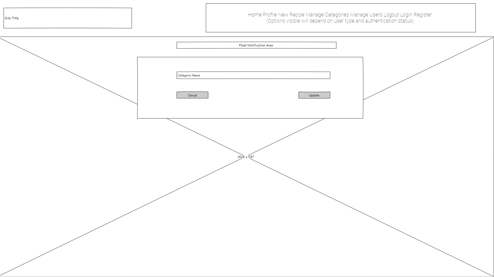
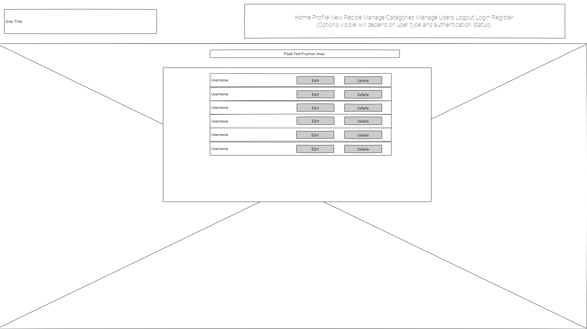
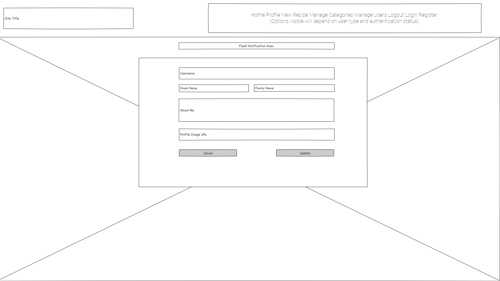

# The Meating Place Website

## 1. Project Websites

View the live project here:  
- [The Meating Place](https://the-meating-place.herokuapp.com/)  

This is the main website for people to contribute, read and exchange recipes. It is designed to be responsive and accessible on a range of devices, making it easy to navigate for amateur and professional chefs alike.

Visit the Project Website and Shared Resource Area Here:  
- [The Meating Place Project](https://github.com/etiennedevaux/TheMeatingPlace)

This is the GitHub project area for people to collaborate, contribute and to download or share code for other projects.

## 2. User Experience (UX)
### User stories

#### First Time Visitor Goals
As a First Time Visitor I want to:
- quickly see a range of the recipes that have been contributed.
- be able to browse the recipes that have already been uploaded.
- be able to view recipe ingredients, equipment and instructions for a selected recipe.
- be able to see a brief profile of the person who uploaded the recipe.

#### Returning Visitor Goals
As a Returning Visitor I want to be able to achieve all of the First Time Visitor goals and also want to:
- be able to register as a user and create my own profile.
- be able to create and save my own recipes.

#### Registered User Goals
As a Registered User I want to achieve all of the First Time Visitor and Returning Visitor goals and also want to:
- be able to edit my user profile.
- be able to update and delete my own recipes.
 
#### Web-Based Administrator
As a Web-Based Administrator I want to be able to achieve all of the First Time Visitor, Returning Visitor and Registered User goals and also want to:   
- Create, Read, Update and Delete the recipe Categories
- Create, Read, Update and Delete Registered Users

### Design  
#### Colour Scheme  
The two main colours used are purple and white, but the artwork includes many shades in order to portray an authentic French-style restaurant.

#### Typography
The Montserrat font is the main font used throughout the whole website with Sans Serif as the fallback font in case for any reason the font isn't being imported into the site correctly. Montserrat is a clean font, so it is both attractive and will work well for different screen sizes.  Variety is provided with use of colours, letter spacing, shadows and varying font weights.

#### Imagery  
The background imagery is important, and is visible throughout the site.  Low levels of transparency are used to help the main features blend naturally with the background image. The images is designed to portray an image of informal dining, with high-quality, well prepared food.

## 3. Wireframes

Wireframes are created using the Evolus Pencil wireframe and prototyping tool [Evolus Pencil](https://pencil.evolus.vn/)

### Home Page / Recipe Page Wireframe
Desktop  

Tablet  
  
Mobile    
  

### Login Page Wireframes  
Desktop  

Tablet  
  
Mobile    

### Edit Recipe Page Wireframe  
Desktop  
  
Tablet  
  
Mobile    

### Register Page Wireframe
Desktop  
  
Tablet  
  
Mobile    

### Profile Page Wireframe  
Desktop  
  
Tablet  
  
Mobile    

### Edit Personal Profile Page Wireframe
Desktop
  
Tablet  
  
Mobile    

### New Recipe Page Wireframe
Desktop  
  
Tablet  
  
Mobile    

### Manage Categories Page Wireframe
Desktop  
  
Tablet  
  
Mobile    

### Edit Categories Page Wireframe
Desktop  
  
Tablet  
  
Mobile    

### Manage Users Page Wireframe
Desktop  
  
Tablet  
  
Mobile    

### Edit User Page Wireframe
Desktop  
  
Tablet  
  
Mobile    

## 4. Features
Responsive design, ensuring a high-quality user experience on all device sizes.  

Consistent design of user controls across the site.

Defaults to a well designed 404 page, providing user feedback if a URL does not exist and on errors where a find query returns no results.

The search filter is a drop down, select box, which is only populated with categories that have been associated with a menu.  
The W3C Markup Validator and W3C CSS Validator Services were used to validate every page of the project to ensure there were no syntax errors in the project.  

### 4.1 Navigation Bar and Background Image  

The Navigation Bar appears throughout the user journey on the site, ensuring that users always have rapid navigation across and around the site.

The Navigation Bar itself is responsive, so that it changes with screen sizes to adapt to different devices.  The options appearing on the navigation bar vary in accordance with whether the user is new, registered and logged in or logged in as an administrator.

The colour scheme reflects the background image, which also appears throughout the site.

### 4.2 Home Page / Recipes Page

The home page and recipes page are the same.  The purpose of the site is immediately clear, and does not warrant distracting information.  This page is visible to all users, the features within it change in accordance with whether or not the user is logged in and whether or not they are the owner of the recipes.

The Recipes are listed in reverse order of when they were added or last modified.

#### 4.2.1 Recipe Information

The recipe information appears firstly in a long list with a summary.  That summary contains an image, a title, a description and information about the creator.

An arrow on the image indicates that the user should click for more information, in fact they can click on any part of the recipe row.  When they do this information about the Ingredients, Equipment and Cooking Instructions appear.

If the person logged in was the creator of the recipe then an Edit button will appear, clicking on this will take the user to the Edit Recipe page.

With a second click, that additional information disappears.

#### 4.2.2 Recipe Creator Information

The name of the creator and their image appear by default.  When the mouse is over the image then user profile information replaces the recipe description.  When the mouse is moved away this reverts.

For small devices, such as mobile devices, the creator image disappears to prioritise the recipe information.

#### 4.2.3 Recipe Filters

The recipes can be filtered by the Course Category (e.g. Main, Dessert, Starter etc).

The data query is designed to only show the categories that have been used plus the 'All', so that a zero return will not happen.  Categories can, therefore, be available to users creating new recipes, but until they are used they will not appear in the dropdown.

The backend Python handles the All option so that the recipes are not filtered.

The dropdown defaults to 'All', and returns to 'All' when a filter is applied - this gives a single click to clear the filter.

### 4.3 Register Page

The Register Page serves the simple purpose of allowing new users to register an account.

All fields are completed by the user typing, they then click the Register button that posts the content to the Flask App, which creates the relevant document in the MongoDB database.

Once the registration is posted the user is given a confirmation in the Flash Message area and then logged in with their new credentials and directed to their personal profile page, which they can edit at any time.

If the username already exists the user is given a message to that effect in the Flash Message area and then directed to a blank registration page.

### 4.4 Login Page

The login page allows the user to enter their username and a hashed password.

Once logged in a Welcome message is shown in the Flash Messages area and the user is directed first to their Profile Page.

### 4.5 Profile Page

The profile page shows a user their own profile.  When profile is selected from the Navigation Bar the backend Python detects the username and renders the profile template, populated with the correct data.  

A user attempting to interpolate the URL may be successful, but will not be shown the edit button, so security will not be breached.  An unsuccessful attempt to interpolate, or accidental entry of a URL, will direct to the 404 page.

### 4.6 Edit Profile Page

The Edit Profile page takes the username from the environment,and will therefore only edit the profile for the logged in user.

The editable fields of the user profile are displayed (username and password are not editable)

### 4.7 New Recipe Page

The New Recipe menu option appears only to logged in users.

Recipe Categories are drawn the full Categories list, managed by the Admin account.  An entry is mandated.

The rest of the fields are text entry with the Recipe Name and Recipe Description being mandated.

### 4.8 Edit Recipe Page

The edit recipe page allows the recipe owner to change any of the fields and submit an update.

The owner can also delete a recipe

Changes are confirmed via the Flash Messages window

### 4.9 Manage Categories Page

The manage categories page is only available to the admin user.

Categories can be created, read, updated or deleted from here.

All existing categories can be viewed on a single screen.

### 4.10 Add New Category Page

The new category is typed in, once posted the addition is confirmed in the Flash Messages window and the user returned to the Manage Categories Page

### 4.11 Edit Category Page

The page is prepopulated with the selected category.
Changes are typed in, once posted the change is confirmed in the Flash Messages window and the user returned to the Manage Categories Page

### 4.12 Manage Users Page

The Manage Users page is only available to the admin user.

All users are listed with username, given name and family name.

Users can be edited or deleted.

### 4.13 Edit User Page

The Edit User page is only available to the admin user.

username, given and first names, about me section and the profile image can be updated.

Once submitted the action is confirmed and the user returned to the Manage Users Page.

### 4.14 Log Out

When the log out option is selected the action is confirmed via the Flash Messages section

The user is returned to the Login Page

## 5. Technologies Used

### 5.1 Web Front End Technologies
HTML5  
CSS3  
Javascript  

### 5.2 Web Backend Technologies
Python
Flask
Jinja

### 5.3 External Libraries  

Bootstrap JS 5.1.0:  
Bootstrap CSS 4.1.3 (to avoid presentation issues due to change in use of relative position)  
- Bootstrap was used to assist with the responsiveness and styling of the website.  
Font Awesome:  
- Font Awesome was used on all pages throughout the website to add icons for aesthetic and UX purposes.  
Materialize 1.0.0  
- Used to assist with the responsiveness and form design, particularly around validation and formatting.  

jQuery 3.5.1:  

Git
- Git was used for version control by utilizing the Gitpod terminal to commit to Git and Push to GitHub.
GitHub
- GitHub is used to store the projects code after being pushed from Git.
Microsoft Photo Editor
- Photo Editor resizing images and editing photos for the website.
Pencil:
- Pencil was used to create the wireframes during the design process.

Visual Studio Code
- Used as a the primary file editor
- User to run and maintain the local Python and Flask environments

Mongo DB
- Used as the backend database

Heroku
- Used as the cloud platform to run Python and Flask, with connectivity to MongoDB for web-based access

## 6 Validator Results

### 6.1 W3C Markup Validator - Results

Each page will be navigated to and checked in the same browser to ensure no permission issues

- Home Page / Recipes Page - Pass
- Register Page - Pass
- Login Page - Pass
- Profile Page - Pass
- Edit Profile Page - Pass
- New Recipe Page - Pass
- Edit Recipe Page - Pass
- Manage Categories Page - Pass  
- Add New Category Page - Pass
- Edit Category Page - Pass
- Manage Users Page - Pass
- Edit User Page - Pass
- 404 Page - Pass

### 6.2 W3C CSS Validator - Results

- style.css - Pass

## 7. Testing User Stories from User Experience (UX) Section
The 404 page gives clear feedback to the user, and after a short delay, will redirect to the home page.  The Home Page can be selected sooner.

### 7.1 General Error Handling

- Go to the Home Page
- Add an extra digit in the url bar to create an invalid url

When the invalid URL is entered, or other errors as handled by the Python app - such as zero data returns, the 404 page should be shown.
Select the link - Click Here For the Starting Page
The Home Page should now be loaded

Repeat the steps and wait for the automatic return to the Home Page.

### 7.2 First Time Visitor Goals
As a First Time Visitor I want to:
- quickly see a range of the recipes that have been contributed.
- be able to browse the recipes that have already been uploaded.
- be able to view recipe ingredients, equipment and instructions for a selected recipe.
- be able to see a brief profile of the person who uploaded the recipe.
- be able to filter for recipes of a particular category

To ensure these goals are met, carry out the tests below

- Load the Home Page  
> 1. Home, Log In and Register should be visible to the right of the Nav bar

- Scroll Up and Down  
> 1. The Recipe List, assuming it is longer than a page, should scroll up and down.
> 2. For each recipe there should be an image of the recipe, title, creator and a short description

- Click on any part of the Recipe row  
> 1. Ingredients, equipment and instructions should show
> 2. Click again on the recipe row and these should disappear

- Move the mouse over the image of the Recipe Creator
> 1. The recipe description should be replaced by the About Me section of the recipe creator
> 2. When the mouse is moved away the Recipe Description should once again be visible

- Find the Apply Button next to the Recipe Filter
> 1. Click on the Apply button with the default value 'All' - this should show all recipes, which is probably no change
> 2. Now select one of the other options, e.g. Main Course (only the Categories that are in use will be available) and click Apply
> 3. Check that only Main Course recipes should be showing
> 4. Click Apply again and All recipes should be showing

#### Returning Visitor Goals

As a Returning Visitor I want to be able to achieve all of the First Time Visitor goals and also want to:
- be able to register as a user and create my own profile.
- be able to create and save my own recipes.

To ensure these goals are met, carry out the tests below

- Register Page
> 1. Go to the Home Page
> 2. Click on the 'Register' option should display at the top right hand of the Nav bar
> 3. The Register Page serves the simple purpose of allowing new users to register an account.
> 4. Enter details as per the headings, all fields are completed by the user typing (try creating a Test User, with a Username testuser or similar, enter a URL for the profile image, perhaps the image from one of your own social media pages, or enter the following https://the-meating-place.herokuapp.com/static/images/test_recipe.jpg)
> 5. Click the Register button that posts the content to the Flask App, which creates the relevant document in the MongoDB database.
> 6. Check that once the registration is posted the user is given a confirmation in the Flash Message area and then logged in with their new credentials
> 7. Check that you have been directed to the personal profile page for the Test User.
> 8. Log out
> 9. Try to register with the same username, as the username already exists the user is given a message to that effect in the Flash Message area and then directed to a blank registration page.

- Login Page
> 1. Login as the Test User you have created
> 2. You should see a Welcome message is shown in the Flash Messages area
> 3. You should be directed to the Personal Profile for the Test User

- Profile Page
> 1. Check that your Given and Family names are showing correctly.
> 2. Check that the image you selected is showing
> 3. Check that your About Me text is showing
> 4. At the top left of the image there should be an Edit button
> 5. Select Home to go back to the Home Page
> 6. Select Profile to see that the correct profile page is showing

- New Recipe Page
> 1. Click on New Recipe (this will only be visible when you are logged in)
> 2. Select a Menu Category from the dropdown. in this case try Amuse Gueule
> 3. Put entries into the other text fields
> 4. For the Recipe Image enter the URL https://the-meating-place.herokuapp.com/static/images/test_recipe.jpg
> 5. Click Add Recipe
> 6. Check that you receive a confirmation in the Flash Messages area
> 7. You should be redirected to the Home Page
> 8. Recipes are ordered by the date on which they are uploaded, your recipe should appear at (or near if other recipes have been entered that day) the top

- Log Out
> 1. Click on the Log Out at the right hand side of the Nav bar
> 2. You should receive confirmation via the Flash Messages section
> 3. You should be directed to the Log In screen

#### Registered User Goals
As a Registered User I want to achieve all of the First Time Visitor and Returning Visitor goals and also want to:
- be able to edit my user profile.
- be able to update and delete my own recipes.

To ensure these goals are met, carry out the tests below

- Edit Profile Page
> 1. From the Home Page select the Log In option
> 2. Log In as the Test User you previously created
> 3. You should now see yoru personal Profile Page, with an Edit button.  Click on Edit
> 4. Add a sentence to the About Me section
> 5. Click on Update Profile
> 6. Check that your sentence has been added.

- Edit Recipe Page
> 1. Ensure that you are still logged in as the testuser
> 2. Go to the Home Page
> 3. Click on the Test Recipe
> 4. At the top of the Recipe Details you should see an Edit button, click on the Edit button
> 5. Check that the form is populated with the existing information for that recipe
> 6. Add an ingredient
> 7. Select Update Recipe
> 8. You should now be redirected to the Recipes page, click on the Test Recipe and check that your ingredient has been added
> 9. Click on Edit
> 10. Click Delete, and check that a confirmation shows, Confirm Deletion
> 11. Check that the Test Recipe has gone

#### Web-Based Administrator
As a Web-Based Administrator I want to be able to achieve all of the First Time Visitor, Returning Visitor and Registered User goals and also want to:   
- Create, Read, Update and Delete the recipe Categories
- Create, Read, Update and Delete Registered Users

To ensure these goals are met, carry out the tests below

- Manage Categories Page
> 1. Go to the Home Page
> 2. If you are not logged in then Log In as the admin (username: admin password: IamAdmin)
> 3. The Manage Categories option should be visible in the Nav bar, click on it
> 4. You should be able to see all the existing categories, click on Add New Category
> 5. Enter the Category Name Test Category and click Add Category
> 6. Check that the Test Category appears (near the bottom as it is sorted alphabetically)
> 7. Click on the Edit Button next to it
> 8. Change it to read A Test Category and click Update Category
> 9. This category should now appear at or near the top
> 10. Click on the Delete Category button next to it
> 11. A Test Category should now disappear

- Manage Users Page
> 1. Click on the Manage Users option on the Nav bar (only visible if you are logged in as Admin)
> 2. All users are listed with username, given name and family name.
> 3. Next to the testuser click on Edit
> 4. The admin user can change any of the fields that the user can change for their own profile, but for all users.  The admin can also change the username.
> 5. Change the given name to Tested and check the list again to see that the change has been made
> 6. Click on the Delete button next to testuser
> 7. Check that the user has gone

### Further Testing
The Website was tested on Google Chrome, Internet Explorer, Microsoft Edge and Safari browsers.
The website was viewed on a variety of devices such as Desktop, Laptop, iPhone7, iPhone 8 & iPhoneX.
A large amount of testing was done to ensure that all pages were linking correctly.
Friends and family members were asked to review the site and documentation to point out any bugs and/or user experience issues.

### Known Bugs
If the admin changes the username for a use who has created recipes the Python throws up errors due to the inconsistency of data across the tables.  This error became evident late in the testing and will need to be corrected in a future release.

## 8. Deployment

### 8.1 Deployment Overview

To successfully run, share, develop and re-use this project the following components have to be deployed

- Visual Studio Code

- GitHub Desktop

- GitHub

- Python

- Flask

- PYMongo

- MongoDB

- HEROKU

### 8.2 Visual Studio Code

GitHub Pages
The project was deployed to GitHub Pages using the following steps...

Log in to GitHub and locate the GitHub Repository
At the top of the Repository (not top of page), locate the "Settings" Button on the menu.
Alternatively Click Here for a GIF demonstrating the process starting from Step 2.
Scroll down the Settings page until you locate the "GitHub Pages" Section.
Under "Source", click the dropdown called "None" and select "Master Branch".
The page will automatically refresh.
Scroll back down through the page to locate the now published site link in the "GitHub Pages" section.
Forking the GitHub Repository
By forking the GitHub Repository we make a copy of the original repository on our GitHub account to view and/or make changes without affecting the original repository by using the following steps...

Log in to GitHub and locate the GitHub Repository
At the top of the Repository (not top of page) just above the "Settings" Button on the menu, locate the "Fork" Button.
You should now have a copy of the original repository in your GitHub account.
Making a Local Clone
Log in to GitHub and locate the GitHub Repository
Under the repository name, click "Clone or download".
To clone the repository using HTTPS, under "Clone with HTTPS", copy the link.
Open Git Bash
Change the current working directory to the location where you want the cloned directory to be made.
Type git clone, and then paste the URL you copied in Step 3.
$ git clone https://github.com/YOUR-USERNAME/YOUR-REPOSITORY
Press Enter. Your local clone will be created.
$ git clone https://github.com/YOUR-USERNAME/YOUR-REPOSITORY
> Cloning into `CI-Clone`...
> remote: Counting objects: 10, done.
> remote: Compressing objects: 100% (8/8), done.
> remove: Total 10 (delta 1), reused 10 (delta 1)
> Unpacking objects: 100% (10/10), done.
Click Here to retrieve pictures for some of the buttons and more detailed explanations of the above process.

## 9 Data Structure

### 9.1 Entity Relationship Diagram  
Entity Relationship Diagram  

## 10. Credits
Code
The full-screen hero image code came from this StackOverflow post

Bootstrap4: Bootstrap Library used throughout the project mainly to make site responsive using the Bootstrap Grid System.

MDN Web Docs : For Pattern Validation code. Code was modified to better fit my needs and to match an Irish phone number layout to ensure correct validation. Tutorial Found Here

Content
All content was written by the developer.

Psychological properties of colours text in the README.md was found here

Media
All Images were created by the developer.
Acknowledgements
My Mentor for continuous helpful feedback.

Tutor support at Code Institute for their support.

##1. Future Developments

Updated deprecated functionality

Enhance security to prevent interpolation of URLs

Extend search capabilities

User Dashboard

Recipe stories

REgistration date for users

Some functions are still potentially vulnerable to URL interpolation.  

Password change by user.

Adjust CSS to allow Bootstrap CSS to be brought in line with the Bootstrap Javascript

If the user submits with no image substitute in the URL for a generic avatar
Search facility for users, may be needed as the numnber of users expands